# Fear & Greed + VIX macOS Desktop Widget

A native macOS desktop widget that displays real-time **CNN Fear & Greed Index** and **CBOE VIX** data. Built with SwiftUI/WidgetKit and a Node.js backend proxy.

> **⚠️ Disclaimer:** This is an [Antigravity](https://github.com/google-deepmind/antigravity) test/learning project. It is **not** intended for commercial use, business purposes, or any form of profit. Use at your own discretion.


## Preview

<p align="center">
  
</p>

## Features

| Size                   | Content                                          | Refresh      |
| ---------------------- | ------------------------------------------------ | ------------ |
| **Small** (square)     | Fear & Greed score, rating, timestamp            | Every 60 min |
| **Medium** (rectangle) | Fear & Greed (left) + VIX price & change (right) | Every 15 min |

- 🎨 Dynamic color coding — red (extreme fear) → orange (fear) → gray (neutral) → green (greed) → mint (extreme greed)
- 📊 VIX shows price, daily change, and change percentage
- 🕐 Timestamp shows when data was last fetched

## Architecture

```mermaid
flowchart LR
    subgraph Widget["🖥️ macOS Widget (SwiftUI)"]
        W_SM["Small\n(Fear & Greed only)"]
        W_MD["Medium\n(F&G + VIX)"]
    end

    subgraph Backend["⚙️ Node.js Proxy (localhost:8080)"]
        direction TB
        IDX["index.ts\nMiddleware\n(rate limit · headers · routing)"]
        R_FG["routes/feargreed.ts"]
        R_VIX["routes/vix.ts"]
        S_CNN["services/cnn.ts"]
        S_VIX["services/vix.ts"]
        Z_CNN["schemas/cnn.ts\n(Zod validation)"]
        Z_VIX["schemas/vix.ts\n(Zod validation)"]

        IDX -->|"GET /"| R_FG
        IDX -->|"GET /vix"| R_VIX
        R_FG --> S_CNN
        R_VIX --> S_VIX
        S_CNN --> Z_CNN
        S_VIX --> Z_VIX
    end

    subgraph External["🌐 External APIs"]
        CNN["CNN\nFear & Greed\nAPI"]
        GOOG["Google Finance\nVIX:INDEXCBOE"]
    end

    W_SM -->|"HTTP GET /"| IDX
    W_MD -->|"HTTP GET /\nHTTP GET /vix"| IDX
    S_CNN -->|"fetch + User-Agent"| CNN
    S_VIX -->|"fetch + User-Agent"| GOOG
    Z_CNN -.->|"validated JSON"| R_FG
    Z_VIX -.->|"validated JSON"| R_VIX
```



**Why a proxy?** CNN and Google Finance block direct API requests from non-browser clients. The Node.js proxy adds the required `User-Agent` header and validates responses with [Zod](https://zod.dev/).

## Prerequisites

- **macOS 14.0+** (Sonoma or later)
- **Xcode 15+** with Command Line Tools
- **Node.js 18+** and npm

## Quick Start

### 1. Start the Backend Proxy

```bash
cd backend
npm install
npm run build
npm start
```

Verify the endpoints:

```bash
# Fear & Greed
curl http://localhost:8080
# → {"score":38,"rating":"fear","timestamp":"..."}

# VIX
curl http://localhost:8080/vix
# → {"price":21.01,"change":1.92,"changePercent":10.06,"timestamp":"..."}
```

### 2. Build & Run the Widget

1. Open `mac-widget/FearGreedWidget/FearGreedWidget.xcodeproj` in Xcode.
2. Select the **`FearGreedWidget`** scheme (top center dropdown).
3. Ensure the target is **My Mac**.
4. Press **`Command + R`** to build and run.
5. A blank container app window appears — minimize or close it.

### 3. Add the Widget to Your Desktop

1. Click the **date/time** in your Mac's top-right menu bar.
2. Scroll to the bottom and click **Edit Widgets**.
3. Search for **"FearGreed"** or **"Market Sentiment"**.
4. Choose **Small** (Fear & Greed only) or **Medium** (Fear & Greed + VIX).
5. Drag it onto your desktop or Notification Center.

## API Endpoints

| Method | Path   | Source           | Response                                      |
| ------ | ------ | ---------------- | --------------------------------------------- |
| `GET`  | `/`    | CNN Fear & Greed | `{ score, rating, timestamp }`                |
| `GET`  | `/vix` | Google Finance   | `{ price, change, changePercent, timestamp }` |

## Project Structure

```
fear-greed-widget/
├── LICENSE
├── README.md
├── .gitignore
├── backend/                    # Node.js proxy server
│   ├── .env.example            # Environment variable reference
│   ├── src/
│   │   ├── index.ts            # Entry point (middleware + route dispatch)
│   │   ├── routes/
│   │   │   ├── feargreed.ts    # Fear & Greed route handler
│   │   │   └── vix.ts          # VIX route handler
│   │   ├── services/
│   │   │   ├── cnn.ts          # CNN data-fetching logic
│   │   │   └── vix.ts          # Google Finance VIX scraping
│   │   ├── schemas/
│   │   │   ├── cnn.ts          # Zod schemas for CNN response
│   │   │   └── vix.ts          # Zod schemas for VIX response
│   │   ├── utils/
│   │   │   ├── error.ts        # AppError class + handler
│   │   │   ├── headers.ts      # Security response headers
│   │   │   └── rateLimit.ts    # In-memory rate limiter
│   │   └── __tests__/
│   │       ├── cnn.test.ts     # CNN schema tests
│   │       └── vix.test.ts     # VIX schema tests
│   ├── package.json
│   └── tsconfig.json
├── mac-widget/
│   └── FearGreedWidget/        # Xcode project
│       ├── FearGreedWidget/    # Container app (macOS)
│       └── FearGreedWidgetExtension/
│           ├── FearGreedWidgetExtension.swift       # Widget code
│           ├── FearGreedWidgetExtensionBundle.swift  # Widget registration
│           └── Info.plist                            # ATS & extension config
└── shared/
    └── types/                  # Shared TypeScript interfaces
        ├── cnn.ts
        └── vix.ts
```

## Testing

### Backend Unit Tests

```bash
cd backend
npm test
```

Runs Zod schema validation tests for both CNN and VIX data formats.

### Manual Verification

```bash
# Verify Fear & Greed endpoint
curl -s http://localhost:8080 | python3 -m json.tool

# Verify VIX endpoint
curl -s http://localhost:8080/vix | python3 -m json.tool

# Build the Swift widget (without Xcode GUI)
cd mac-widget/FearGreedWidget
xcodebuild -scheme FearGreedWidget -sdk macosx build
```

## Troubleshooting

### Widget shows "50 / Neutral"

The widget can't reach the backend. Ensure:

1. The Node.js proxy is running (`npm start` in the `backend/` directory).
2. The widget extension has **Outgoing Connections (Client)** enabled in Xcode → Target → Signing & Capabilities → App Sandbox.
3. Clean install: kill stale processes and rebuild:
   ```bash
   killall FearGreedWidgetExtensionExtension 2>/dev/null
   rm -rf ~/Library/Developer/Xcode/DerivedData/FearGreedWidget-*
   ```
   Then `Shift + Cmd + K` → `Cmd + R` in Xcode, remove the old widget, and add fresh.

### Widget doesn't update after code changes

WidgetKit caches the extension binary. Always do a clean build:

```bash
killall FearGreedWidgetExtensionExtension 2>/dev/null
rm -rf ~/Library/Developer/Xcode/DerivedData/FearGreedWidget-*
```

### VIX endpoint returns an error

Google Finance may temporarily block requests. Wait a minute and retry. The proxy uses a browser User-Agent to avoid detection.

## Tech Stack

| Layer         | Technology                                            |
| ------------- | ----------------------------------------------------- |
| Widget UI     | Swift, SwiftUI, WidgetKit                             |
| Backend Proxy | Node.js, TypeScript, Google Cloud Functions Framework |
| Validation    | Zod                                                   |
| Testing       | Vitest                                                |
| Data Sources  | CNN Fear & Greed API, Google Finance                  |

## Disclaimer

This project was built as part of an **Antigravity** coding exercise for educational and experimental purposes only. It is **not** designed for production deployment, commercial use, or profit. The data displayed is sourced from third-party APIs (CNN, Google Finance) and may be subject to their respective terms of service.

## License

MIT
